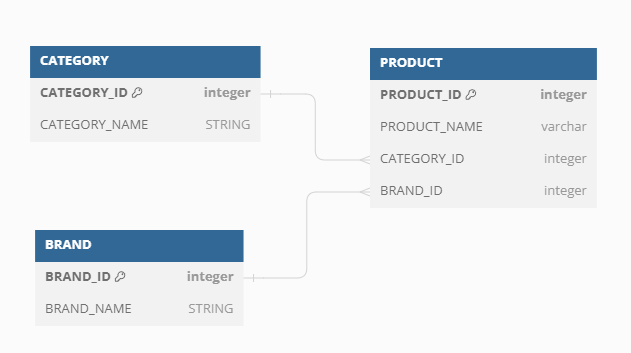

## 프로젝트
코디를 완성할 수 있도록 도와주는 서비스

## Feature


## 실행방법
* build
```cmd
./gradlew clean build bootJar
```
* test
```cmd
./gradlew test
```

* run (default port:8080)
```cmd
java -jar build/libs/musinsa-0.0.1-SNAPSHOT.jar
```

## 구현

다음 항목들에 대해 구현하였습니다.
 - 카테고리 별 최저가격 브랜드와 상품 가격, 총액을 조회하는 API
 - 단일 브랜드로 모든 카테고리 상품을 구매할 때 최저가격에 판매하는 브랜드와 카테고리의 상품가격, 총액을 조회하는 API
 - 카테고리 이름으로 최저, 최고 가격 브랜드와 상품 가격을 조회하는 API
 - 카테고리, 브랜드에 대한 생성, 조회, 수정, 삭제
 - 상품에 대한 생성, 수정, 삭제 

## 문제해결전략

### 1. 테이블 구조



카테고리, 브랜드, 상품테이블로 구성하였습니다.

### 2. SQL

문제해결을 위해 SQL을 생각해 보았습니다.

```sql
SELECT CATEGORY_ID, MIN(PRICE) 
FROM PRODUCT 
GROUP BY CATEGORY_ID
```

카테고리별 최저금액을 찾기 위해서 CATEGORY_ID로 GROUP BY를 해야합니다.

해당 SQL은 전체를 탐색해서 GROUP 하기에 데이터가 많아질 경우 성능 문제가 발생할 수 있다고 판단했습니다.

그래서 다음과 같은 접근 방식을 고려했습니다.

```sql
SELECT PRODUCT_ID, NAME, PRICE, CATEGORY_ID, BRAND_ID
FROM PRODUCT
WHERE CATEGORY_ID = 1
ORDER BY PRICE ASC
LIMIT 1
```

CATEGORY_ID 와 PRICE로 인덱스를 생성하고 CATEGORY_ID와 PRICE로 정렬하면 최저, 최대 가격의 상품을 빠르게 조회할 수 있다고 판단했습니다.

### 3. 캐시

경우에 따라 한 번의 무거운 SQL 보단 여러 CONNECTION이 발생하더라도 가벼운 SQL을 여러번 하는 것이 더 빠를 수 있습니다.

그래서 위의 SQL을 이용하면 빠르게 캐시 데이터를 추가/수정할 수 있다고 생각했습니다. 

- **상품이 추가/수정/삭제될 때마다 카테고리별 최소 최대 상품을 계속 캐시**
```json lines
{
  "아우터": {
    "min": {"brand": "C", "price": 10000},
    "max": {"brand": "I", "price": 11400}
  },
  "상의": {
    "min": {"brand": "E", "price": 5000},
    "max": {"brand": "F", "price": 7200}
  }
  ...
}
```

- **상품이 추가/수정/삭제될 때마다 브랜드별 각 카테고리의 최저 금액 상품 캐시**
```json lines
{
  "브랜드A" : {
    "brand": "브랜드A",
    "categoryList": [
      {"categoryId": "상의","price": 1000},
      {"categoryId": "아우터","price": 2000},
      {"categoryId": "바지","price": 3000}
        ...
      ]
  "브랜드B" : {
    "brand": "브랜드B",
    "categoryList": [
      {"categoryId": "상의","price": 5000},
      {"categoryId": "아우터","price": 6000},
      {"categoryId": "바지","price": 7000}
        ...
      ]
  }
}

```
1~3 구현은 위의 캐시를 이용하였습니다.


## 기타 및 개선사항

실행 환경을 고려하여 로컬 메모리 사용했습니다. ( redisRepository이름으로 사용합니다. )

InitData 클래스로 준비된 데이터를 셋팅했습니다.

카테고리명과 브랜드명을 캐시하지 않아 로직에서 각각의 이름을 추가하는 로직때문에 소스가 복잡해진 점이 있습니다.

동일한 금액 상품이 2개 이상일 때 같은 금액을 삭제할 경우 캐시에서 사라지는 점을 수정해야 합니다. (EX 동일 금액에 대한 수량 관리)

에러 발생 케이스 및 에러 테스트가 미흡 합니다.

#감사합니다.
